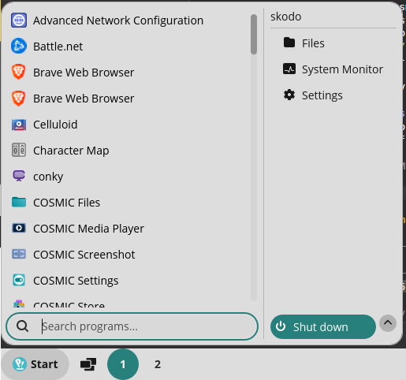

# cosmic-applet-startmenu

> **⚠️ AI-generated project.** The code, documentation, and commit history in
> this repository were produced by an AI coding agent (Claude Code). It has
> not been run inside an actual COSMIC session (see *Status* below) — review
> and test it yourself before relying on it.



A [COSMIC](https://github.com/pop-os/cosmic-epoch) panel applet with a
classic, Windows-7-"Classic Shell"-style start menu: an icon + "Start" in
the panel, a two-pane "All Programs" menu with a search box, and a Shut Down
button that actually shuts down — no confirmation dialog, no countdown.

## Status

Builds and passes its unit tests against real `pop-os/libcosmic` (verified
in this repo's dev environment: `cargo +nightly check`, `cargo +nightly
clippy`, `cargo +nightly test`, and `cargo +nightly build` all succeed and
produce a linked binary). It has **not** been run inside an actual COSMIC
session in this environment (no Wayland compositor available here) — do
that before relying on it.

## Requirements

- **A nightly Rust toolchain.** `libcosmic`'s `master` branch currently
  declares a newer MSRV than the latest stable `rustc` satisfies (this repo
  hit `requires rustc 1.93` against stable 1.91.1 while building). Install
  one with `rustup install nightly`, then build with `cargo +nightly build
  --release` (or `rustup override set nightly` in this directory).
- System dev packages for Wayland/X11/GPU/font libraries that `iced`'s
  `wgpu`/`winit` stack link against: `wayland`, `libxkbcommon`, `fontconfig`,
  `freetype`, `expat`, Vulkan/GL loaders, and the X11 client libs. On a
  COSMIC/Pop!_OS machine these are already present; `flake.nix` lists the
  Nix equivalents.

## Building

```sh
just build-release      # or: cargo +nightly build --release
just install             # installs the binary, .desktop entry, and icon
```

`just install` respects `prefix`/`rootdir` the same way the upstream
[cosmic-applet-template](https://github.com/pop-os/cosmic-applet-template)
does, e.g. `just rootdir=debian/cosmic-applet-startmenu prefix=/usr install`
for packaging.

Once installed, add "Start Menu" to the COSMIC panel via **Settings →
Desktop → Panel → Configure panel applets**.

### NixOS

```sh
nix build
```

`flake.nix` uses [fenix](https://github.com/nix-community/fenix)'s rolling
nightly toolchain (see *Requirements* above) and `cargoLock.outputHashes`
for `libcosmic` and its git-sourced dependency tree. **The `fakeHash`
placeholders in `flake.nix` need replacing before this will actually build**:
run `nix build`, it fails on the first one with the real hash in the error
message, paste that in, and repeat until it builds. This is the standard
nixpkgs workflow for Cargo git dependencies — nobody can precompute these
without a working Nix builder with network access, which this development
environment didn't have wired up for FOD fetches.

## How the icon is chosen

1. Read `/etc/os-release`'s `ID` field.
2. Look it up in the *live* icon theme (`distributor-logo-pop-os`,
   `distributor-logo-nixos`, or the generic `distributor-logo` most distro
   branding packages symlink) via `freedesktop-icons`.
3. If nothing's installed, fall back to a bundled SVG:
   `resources/branding/{pop-os,nixos,windows}.svg`. Windows is the fallback
   for every OS that isn't Pop!_OS or NixOS, matching the classic-start-menu
   theme.

The bundled logos are simplified, brand-colored geometric abstractions, not
traced copies of the official marks — swap in the real assets if your use
case needs them, subject to each project's brand guidelines.

## Shutdown

The Shut Down button calls `org.freedesktop.login1.Manager.PowerOff`
directly over D-Bus (see `src/infrastructure/logind_power.rs`) rather than
going through `cosmic-osd` (which is what `cosmic-applet-power` normally
shells out to, and what shows the confirmation/countdown dialog). This is
still graceful: systemd's shutdown target sends `SIGTERM` and honors
`InhibitDelayMaxSec`, so running programs get a chance to exit — there's
just no dialog in front of it. Restart and Suspend work the same way.

## Known Limitations

- The search box in the "All Programs" menu doesn't accept keyboard input
  until you click into it first — opening the menu doesn't auto-focus the
  field, so typing immediately after opening does nothing.

## Architecture

Clean Architecture layering (see `docs/agents/architecture.md`):

```
src/
├── domain/          OsKind, AppEntry, PowerAction, and the port traits
├── application/      use cases + StartMenuService facade + UI-facing DTOs
├── infrastructure/    /etc/os-release, freedesktop-icons, freedesktop-desktop-entry, logind zbus proxy
└── interface/         the libcosmic Application impl and view builders
```

`main.rs` is the composition root: it's the only place that constructs
concrete `infrastructure` adapters and wires them to `application`'s
`StartMenuService`, which is all `interface` ever touches.

## App ID

The App ID is `io.github.MyNameIs-13.CosmicAppletStartMenu`, following the
freedesktop reverse-DNS convention (`io.github.<username>.<AppName>`) for
this project's GitHub namespace. It's used consistently in `Cargo.toml`'s
`repository` field, `justfile`, `src/interface/app.rs`'s `APP_ID`,
`resources/app.desktop`, `resources/app.metainfo.xml`, and the icon's file
path (`resources/icons/hicolor/scalable/apps/io.github.MyNameIs-13.CosmicAppletStartMenu.svg`).